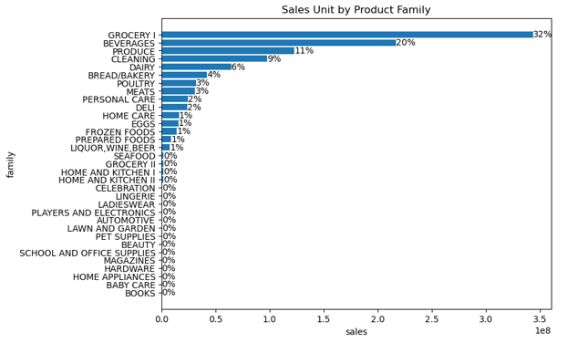
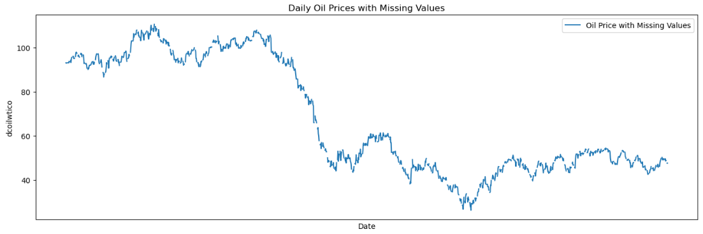
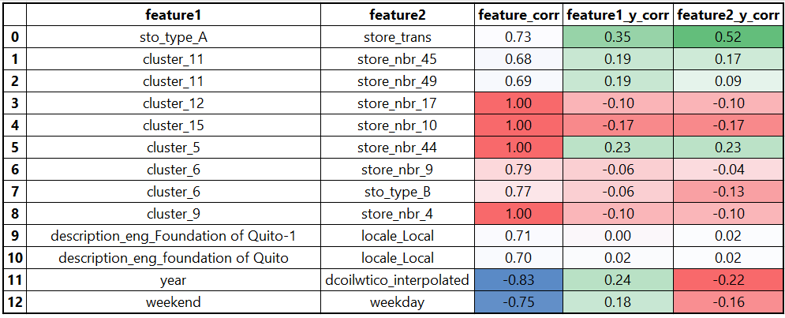
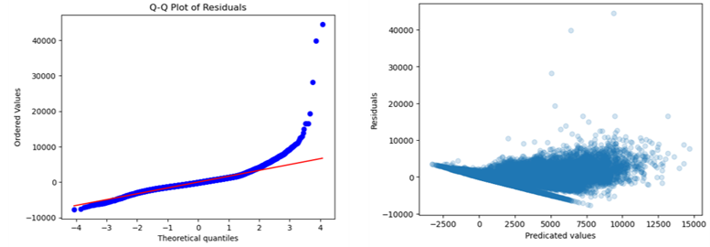
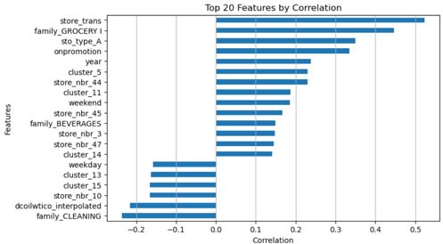
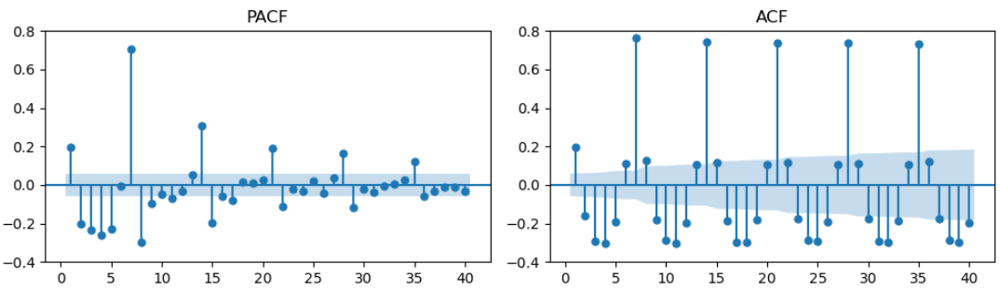
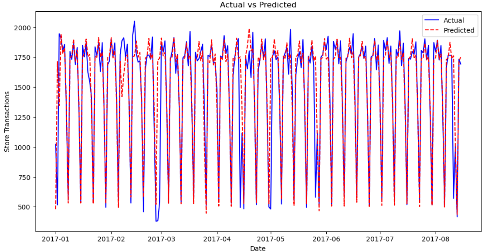
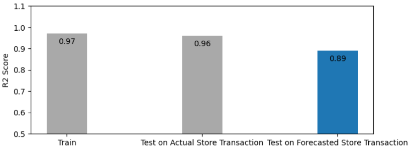

## PRODUCT SALES UNITS FORECASTING

### Executive Summary

Favorita is one of the largest supermarket chains in Ecuador, renowned for its extensive selection of groceries, household items, and other goods. This project aims to predict the sales volumes of key categories in stores located in the capital city. The business goal is to enhance customer experience and optimize inventory planning.

- Phase One: Exploratory Data Analysis (EDA) and modeling was conducted to identify features crucial for forecasting. Three models were tested: Random Forest, Linear Regression, and Decision Tree. Random Forest emerged as the most effective model.
- Key Findings: Store transactions were identified as the most important feature for accurately forecasting category sales volumes, with an importance score of 0.35.
- Phase Two: A Time Series model was applied to predict store transactions. The project combined SARIMAX with Random Forest to forecast category sales units across 17 stores and 5 categories. The resulting model demonstrated robustness, achieving a test R² score of 0.89 and a train score of 0.97.

### Phase One: Understand the Dataset and Feature Importance:

Define project scope

Impute null values

Reduce collinearity

Check target distribution

An earthquake caused GROCERY I's sales units to spike to a record high, resulting in a right-skewed dataset. Sales units over 40k represent only 0.0043% of the data, making it challenging for models to capture these abnormally large sales units.

### Model Performance:
Compared to LR, DT and RF performed much better across all three scores; however, the extremely large sales units contribute to high MAE and MSE in the advanced models.

### Model Evaluation:

Linear Regression: Residuals show clear pattern, indicating unreliable model.

Linear Regression: Most features have low correlations with the target.

Decision Tree: Feature importance

Random Forest: Feature importance

### Phase Two: The Most Important Feature (Store Transaction) Forecasting:
ACF & PACF: Time Series Non-Seasonal Hyperparameter Tuning

ACF & PACF: Time Series Seasonal Hyperparameter Tuning

SARIMAX: Store Transaction Forecasting

Random Forest: Scalable Forecasting for Multiple Stores and Categories

### Methodology

Phase One:
- EDA and Preprocessing
  - Single Table EDA and Cleaning
      - Conduct preliminary data cleaning and exploratory data analysis (EDA) to understand the dataset and prepare for joining the five tables.
      - Perform in-depth EDA and data cleaning to understand the relationship between features (Xs) and the target variable (y).
  - Joint Table EDA and Feature Engineering:
    - Execute full table EDA and preprocessing for data modeling. Note that joining the tables introduced additional null values that required imputation.
    - Engineer features from time series columns to enhance the dataset.
- Linear Regression
  - Apply Principal Component Analysis (PCA) and Grid Search for model fine-tuning.
  - Use stepwise selection for model fine-tuning.
- Advanced Model: 
  - Decision Tree: Conduct manual fine-tuning, coarse Grid SearchCV fine-tuning, and fine Grid SearchCV fine-tuning.
  - Random Forest: Reduce computational cost and enhance model robustness by manually fine-tuning multiple hyperparameters simultaneously using a for loop and one-fold validation.
- Model Evaluation

Phase Two:
- Single Store Transaction Forecast Using SARIMAX
- 17 Store Transaction Forecasts
- Use Forecasted Store Transactions as a Key Feature in a Random Forest Model to Predict Category Sales Units at Scale

### Data Dictionary

#### 1. sales.csv

**store_nbr**: the store at which the products are sold.
**family**: the type of product sold.
**sales**: the total sales for a product family at a particular store on a given date. Fractional values are possible since products can be sold in fractional units (e.g., 1.5 kg of cheese, as opposed to 1 bag of chips).
**onpromotion**: the total number of items in a product family that were being promoted at a store on a given date.

#### 2. stores.csv
Store metadata, including **city, state, type, and cluster**.
cluster is a grouping of similar stores.

#### 3. oil.csv
**Daily oil price**. (Ecuador is an oil-dependent country and it's economical health is highly vulnerable to shocks in oil prices.)

#### 4. holidays_events.csv
Holidays and Events, with metadata
NOTE: Pay special attention to the **transferred** column. A holiday that is transferred officially falls on that calendar day, but was moved to
another date by the government. A transferred day is more like a normal day than a holiday. To find the day that it was actually celebrated, look for the corresponding row where type is Transfer. For example, the holiday Independencia de Guayaquil was transferred from 2012-10-09 to 2012-10-12, which means it was celebrated on 2012-10-12. 

Days that are type **Bridge** are extra days that are added to a holiday (e.g., to extend the break across a long weekend). These are frequently made up by the type **Work Day** which is a day not normally scheduled for work (e.g., Saturday) that is meant to payback the Bridge.

**Additional** holidays are days added a regular calendar holiday, for example, as typically happens around Christmas (making Christmas Eve a holiday).

#### 5. transactions.csv
**transactions**: daily store transactions

#### 6. Additional Notes

Wages in the public sector are paid every two weeks on the 15th and on the last day of the month. Supermarket sales could be affected by this.
A magnitude 7.8 earthquake struck Ecuador on April 16, 2016. People rallied in relief efforts donating water and other first need products which 
greatly affected supermarket sales for several weeks after the earthquake

### Dataset

- https://drive.google.com/drive/folders/1iz1sbEKrBc2eLgTmHnHQM-gkGfXIuOB8?usp=sharing

### Credits & References

- https://scikit-learn.org/stable/modules/generated/sklearn.linear_model.LinearRegression.html
- https://docs.scipy.org/doc/scipy/reference/generated/scipy.stats.probplot.html
- https://scikit-learn.org/stable/modules/tree.html
- https://scikit-learn.org/stable/modules/ensemble.html
- https://www.udemy.com/course/time-series-analysis-in-python